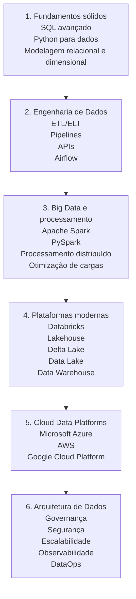

<h1 align="left">Olá, eu sou Lício Martins de Lima 👋</h1>

<h3 align="left">
  Analista de Dados em evolução para Engenharia e Arquitetura de Dados
</h3>


<p align="left">
  
</p>

<p align="left">
  Sou Analista de Dados com experiência em integração, tratamento, automação e análise de grandes bases de dados.
  Atuo com ETL, modelagem, BI, indicadores e apoio à tomada de decisão, conectando dados, processos e visão de negócio.
</p>

<p align="left">
  Atualmente direciono minha carreira para <strong>Engenharia de Dados</strong> e <strong>Arquitetura de Dados</strong>, com interesse em pipelines, modelagem, integração de bases, governança, cloud data platforms e soluções escaláveis.
</p>

<br clear="right"/>

---

## Sobre mim

- 📊 Atuo com análise de dados, BI, ETL e experiência do cliente
- 🐍 Uso Python para automação, tratamento, padronização e integração de dados
- 🗄️ Trabalho com SQL, bancos relacionais, joins, CTEs e estruturação de bases analíticas
- 📈 Tenho experiência com Power BI, DAX, dashboards, KPIs e indicadores de negócio
- 🔄 Já integrei e tratei dados de plataformas como SAP, SGRi, Dynamics 365, SoluCX e Blip
- ⚙️ Reduzi processamento de dados de aproximadamente 1h para 15s com padronização automatizada
- 🧩 Tenho experiência com requisitos, UAT, documentação funcional, User Stories, BPMN, Scrum e Kanban
- 🏗️ Cursando Pós-Graduação em Engenharia e Arquitetura de Dados pela XP Educação
- 🚀 Busco crescer em posições como Data Engineer, Analytics Engineer ou Data Architect

---

## Stack, ferramentas e tecnologias

<p align="left">
  Minha stack está organizada com base nas principais competências para posições de Engenharia de Dados, Analytics Engineering e Arquitetura de Dados: fundamentos fortes em SQL e Python, construção de pipelines, modelagem, cloud, orquestração, plataformas lakehouse e boas práticas de versionamento.
</p>

### Core para Engenharia de Dados

<div align="left">
  
  
  
  
  
</div>

### Processamento, orquestração e plataformas modernas

<div align="left">
  
  
  
  
  
</div>

### Cloud Data Platforms

<div align="left">
  
  
  
  
  
</div>

### Bancos de dados relacionais e NoSQL

<div align="left">
  
  
  
  
  
  
</div>

### BI, análise e visualização de dados

<div align="left">
  
  
  
  
  
  
</div>

### Desenvolvimento, versionamento e boas práticas

<div align="left">
  
  
  
  
  
  
</div>

---

## Competências em desenvolvimento

```text
Fundamentos mais demandados:
SQL | Python | Modelagem de Dados | ETL/ELT | Data Warehousing

Engenharia de Dados:
Pipelines | APIs | Airflow | Spark | PySpark | Databricks | Lakehouse

Cloud e arquitetura:
Azure | AWS | GCP | Data Lake | Data Warehouse | Governança de Dados

Bancos de dados:
SQL Server | MySQL | SQLite | PostgreSQL | NoSQL | MongoDB

Analytics e BI:
Power BI | DAX | Pandas | NumPy | Plotly | Indicadores de negócio

Negócio e processos:
Requisitos | UAT | User Stories | BPMN | Scrum | Kanban | Documentação
```

---

## Roadmap profissional



---

## Meu foco atual

- Construção de pipelines de dados
- Automação de processos com Python
- Consultas, tratamentos e modelagem com SQL
- Integração entre sistemas, bases, APIs e dashboards
- Estruturação de bases para análise e tomada de decisão
- Modelagem dimensional e boas práticas em dados
- Estudos em orquestração com Apache Airflow
- Estudos em Databricks, Lakehouse e processamento distribuído
- Evolução em cloud, arquitetura de dados e engenharia analítica

---

## Atividade e evolução

<p align="left">
  Atualmente estou desenvolvendo projetos e estudos voltados para análise de dados, automação, dashboards, pipelines, modelagem, BI e engenharia de dados.
</p>

```text
Foco técnico atual:
SQL | Python | Power BI | ETL/ELT | Modelagem de Dados | Airflow | Databricks | Cloud

Direção profissional:
Data Engineering | Analytics Engineering | Data Architecture | Data Governance
```


---

## Visão profissional

<p align="left">
  Minha trajetória combina análise de dados, experiência do cliente, requisitos e visão de negócio.
  Por isso, busco construir soluções que não sejam apenas tecnicamente corretas, mas que também façam sentido para o negócio, gerem eficiência operacional e ajudem pessoas a tomar melhores decisões.
</p>

<p align="left">
  Tenho interesse especial em criar pontes entre áreas de negócio e tecnologia, traduzindo problemas reais em soluções baseadas em dados, automação, governança e arquitetura escalável.
</p>

---

## Projetos em destaque

> Em breve, pretendo destacar aqui projetos voltados para análise de dados, automação, dashboards, pipelines e engenharia de dados.

Sugestões de projetos para incluir futuramente:

- Pipeline ETL com Python e SQL
- Dashboard em Power BI com base tratada em Python
- Consumo de API e carga em banco de dados
- Modelagem dimensional para indicadores de negócio
- Análise exploratória com Pandas e visualizações
- Automação de relatórios ou processos operacionais
- Projeto de orquestração com Apache Airflow
- Projeto de Lakehouse ou processamento com Databricks
- Projeto com banco NoSQL para armazenamento semiestruturado
- Projeto em cloud usando Azure, AWS ou GCP

---

## Contato

<div align="left">
  <a href="mailto:liciomlima@gmail.com" target="_blank">
    
  </a>
  <a href="https://www.linkedin.com/in/liciolima/" target="_blank">
    
  </a>
  <a href="https://www.instagram.com/licio.lima/" target="_blank">
    
  </a>
</div>

---

<p align="left">
  Sempre buscando aprender, construir soluções melhores e transformar dados em valor real para o negócio.
</p>
